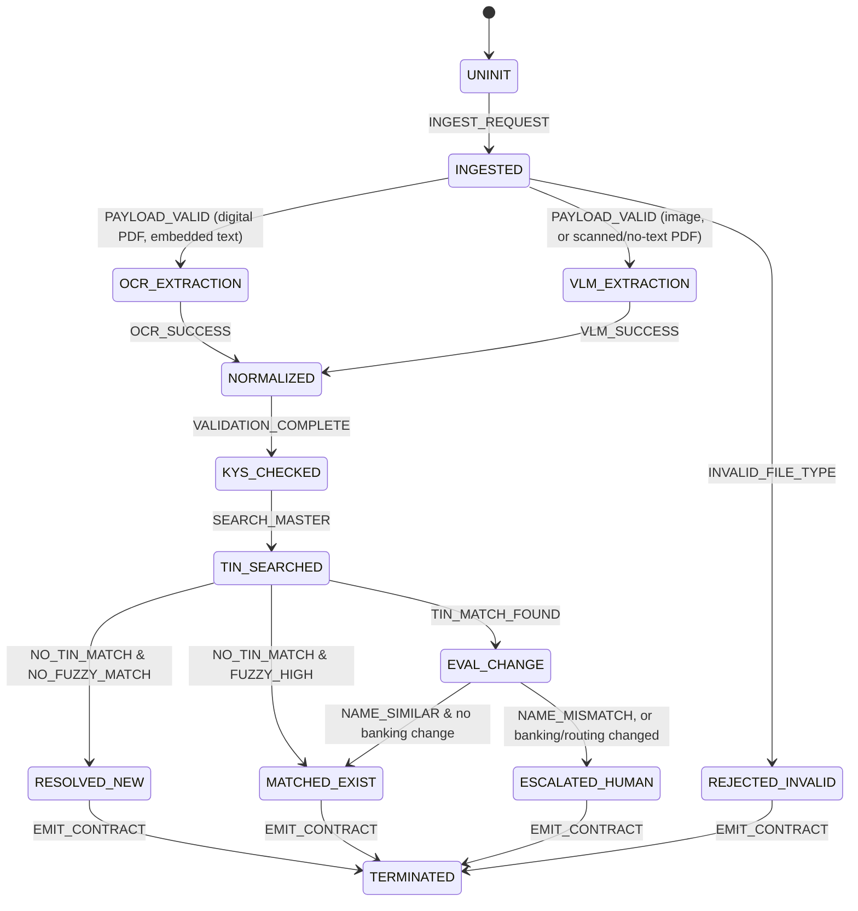

# W-9 Extraction and Supplier Onboarding — Design Document

**Role:** AI Engineer / AI Architect, Central AI Services · **Scope:** US W-9 only, extensible design for other country legal processes · **Companion code:** this repository (`src/`), see `README.md` for the full project structure and what's real vs. mocked.

## 0. Assumptions

Stated up front, per the brief, so disagreement surfaces early rather than in the walkthrough:

1. **Tenant isolation is enforced by the caller of this service, not invented by it.** `tenant_id` is a required input on every call; this service scopes every supplier-master query by it and never infers it. The actual JWT/service-auth boundary that produces a trustworthy `tenant_id` is out of scope (assumed to exist upstream, per "no auth layer" in the brief).
2. **The supplier master is reachable via a query/search API** in production, per the prompt. The prototype simulates this as a CSV load specifically because "you have API access to query and search this supplier master" — the design (§4) is written against an indexed search API, not a full-table scan, and the prototype's in-memory pandas filtering is explicitly called out as a scale simplification, not the target architecture.
3. **W-9 revisions in scope: 2018 and March 2024.** Line 3b (foreign partner indicator) is absent on the 2018 form; the schema treats it as nullable rather than required, and the extractor doesn't penalize its absence.
4. **A "secondary payload"** (banking/ACH details) can optionally accompany the document in the same request, since a raw W-9 itself never contains bank account information but the change-management/fraud story requires *something* to compare against. This is a small, explicit addition to the input contract (§5), not implied by the prompt.
5. **Volume:** 500 customers × 10–50 W-9s/week → roughly 5,000–25,000 documents/week (20K–100K/month) today, growing. This is the number the cost model (§6) and the "why not a trained layout model yet" argument (§3) are built against.
6. **`[2B]` extraction engine: Azure AI Document Intelligence** (`prebuilt-layout` model), chosen for the actual prototype implementation after an earlier vision-LLM implementation (Claude/GPT-4o) was live-tested and found unreliable on checkbox/selection state specifically — see §3.3/§3.4. The interface is provider-agnostic (one `Extractor` protocol), so this was a new class behind the same interface, not a pipeline change.

## 1. Problem framing

Supplier onboarding is the front door to Accounts Payable: every dollar paid out is tied to a supplier record, and that record starts life as a W-9. Two things make this a genuinely hard extraction-plus-decisioning problem rather than a form-parsing exercise:

- **The document is adversarially messy in practice**, not just noisy. Two form revisions, scans, phone photos, handwritten additions, and the occasional wrong form entirely (a W-8 from a foreign supplier) all arrive claiming to be "a W-9."
- **The decision downstream of extraction is higher-stakes than the extraction itself.** A perfectly extracted W-9 that gets matched to the wrong existing supplier — or worse, silently updates a supplier's payment details when the change is actually fraud — does more damage than a missed field ever could. The system's job is not "read the form," it's "decide, with reasoning, whether this is a new supplier, an update, or something a human must look at."

This document treats those as two separably-engineered problems (extraction quality; match/decision quality) that meet at one contract (§5), because they have different failure modes and different owners of risk.

## 2. Architecture overview



One override sits outside this diagram deliberately, rather than being drawn as another branch: **any CRITICAL validation flag (unsigned form, invalid TIN format, missing legal name, or "this doesn't look like a W-9 at all") forces `ESCALATED_HUMAN` regardless of which terminal state the matcher reached.** A clean supplier match against fundamentally unusable extracted data still shouldn't auto-apply. This is implemented as a post-match check (`validation/rules.py:BLOCKING_CODES`, applied in `pipeline.py`), not baked into the matcher, so the two concerns — "is this match right?" and "is this document even usable?" — stay independently testable.

**Module boundaries** (each one is a pure function/class with no knowledge of the FSM; `pipeline.py` is the only place that assembles them into state transitions):

| Module | Responsibility | State(s) |
|---|---|---|
| `ingestion/classifier.py` | Format sniff, embedded-text probe, text-density fallback → routing decision | `[1] INGESTED` |
| `extraction/layout_ocr.py` | Deterministic field extraction from a digital PDF's text layer | `[2A]` |
| `providers/document_intelligence_provider.py` | Azure Document Intelligence extraction (real, required — no mock fallback) | `[2A]`/`[2B]` |
| `validation/rules.py` | Format/consistency checks → `validation_flags`; defines which are blocking | `[3]` |
| `matching/blocking.py` | Candidate generation (TIN-token exact + name-blocking-key fuzzy) | `[4]`→`[5]` |
| `matching/scoring.py` | TIN-match/name-similarity/banking-override decision logic | `[5A]`→`[6x]` |
| `matching/risk_signals.py` | Tenant-wide fraud signal (shared bank account across *different* suppliers) — independent of whether the document matched anything | `[6x]` override |
| `contracts/schema.py` | The API contract — every other module's input/output type | all |
| `security.py` | The only module that ever touches a raw TIN/routing number | `[2A]`/`[2B]`, `[5A]` |
| `pipeline.py` | Orchestrates the above into the FSM; the only state-aware code | `[0]`–`[7]` |

## 3. Extraction approach and tradeoffs

### 3.1 Routing: a 3-stage deterministic probe, not a single always-on model

Rather than picking one extraction technology for every document, `[1] INGESTED` classifies each document *before* spending anything on extraction:

1. **File format / magic bytes.** PNG/JPEG → always `[2B]` (a photo or scan has no embedded text layer by construction; there's nothing for a text-layer extractor to find). Anything that isn't PDF/PNG/JPEG → rejected immediately, no extraction cost incurred.
2. **PDF vector-text probe (PyMuPDF).** A PDF with a real embedded text layer (>100 extractable characters) is a *candidate* for deterministic layout parsing. A PDF that's just a scanned image wrapped in a PDF container (0 embedded characters) goes to `[2B]`.
3. **Text-density fallback.** A PDF that clears the character-count bar but has implausibly little text per page (<300 chars/page — a real W-9 runs 800–1,500) is downgraded to `[2B]`. This substitutes for a genuine DPI/OCR-confidence probe, which only makes sense once there's a real raster OCR engine in the loop (§3.4) — see the honesty note below.

This routing is cheap (milliseconds, no external API call) and deterministic, so the cost model (§6) can actually predict what fraction of traffic hits the expensive path.

### 3.2 `[2A]` Layout OCR: real extraction, not a stub

Three sources, tried in order — all three found and refined by testing against real documents, not designed in advance:

1. **AcroForm widget fields** (`extraction/acroform.py`) — checked first. A real, official fillable PDF (IRS's own published `fw9.pdf`) stores what a supplier types into it in form-field *widgets*, not in the page's text stream at all. This was found as a real gap: testing against an actual official IRS fillable PDF initially returned every field as `null`, because `page.get_text()` only ever sees the static labels/instructions — the filled values are invisible to it. `page.widgets()` reads them directly. The field-name mapping is tuned to IRS's own template specifically. A related bug, also found by testing: `looks_like_this_template()` originally matched on field *names* alone — a "flattened" copy of this same template (source 2, below) can have the right field names with every value empty, which would wrongly commit to reading nothing instead of falling through to source 2. Fixed: also require a populated value.
2. **Flattened-text fallback** (`extraction/flattened_form.py`) — for a PDF where the AcroForm widgets are empty but the typed values got baked into the text stream anyway, appended after the page footer, completely disconnected from their labels. Free-text fields (name, DBA, street, signer) are read positionally relative to a few recognizable anchors (TIN shape, city/state/zip shape, a date). Tax classification needed a second trick: the flattened text has only a lone "X" with no label context, so which of the 7 checkboxes it belongs to can't be read from text alone — but the empty widgets' `.rect` positions are still exactly where the real checkboxes are drawn, so the "X" word's bounding box (from `page.get_text("words")`) can be matched to whichever checkbox widget is nearest. This caught a real case where a plausible guess from the entity name would have been wrong: "Global Tech Solutions **Inc.**" reads as an obvious C-corp guess, but the box actually checked on the document is S-corp.
3. **Text-stream regexes**, as originally designed — PyMuPDF extracts the embedded text stream, and a set of regexes anchored on the W-9's own field labels ("1 Name (as shown on your income tax return):", "Part I Taxpayer Identification Number (TIN):", etc.) locates each field. This is what runs for a printed-and-typed or non-fillable PDF where labels and values genuinely are adjacent.

All three are genuinely working extraction — the current regression set (`tests/test_decision.py`, `data/evaluation_cases.json`) runs against 6 real, non-synthetic W-9 documents (2 typed PDFs exercising sources 1/2, plus 4 real photos/handwritten documents exercising `[2B]`), 100% field-level accuracy — not a placeholder. A separate synthetic fixture set (`scripts/generate_sample_data.py`) covering additional edge cases (invalid file, wrong-form, unsigned, TIN hijack, tenant isolation, shared-bank-account) exists and still works but isn't currently wired into this regression set — see README's "what I deferred."

**Confidence here is derived, not self-reported.** Because this is a native text/form layer rather than a raster scan, there's no OCR-token confidence to report. Confidence instead reflects structural certainty: did the label anchor (or AcroForm field) match, and does the captured value pass its own format check (TIN shape, valid state code, checkbox exclusivity). A field that wasn't found gets `0.0`, not a guessed mid-range number — see §5 on why "I don't know" is a first-class signal, not an afterthought.

**Known limitation, accepted deliberately:** checkbox *state* is read as a literal `[X]`/`[ ]` text token, because that's genuinely what a text-extraction layer sees on a digital, machine-generated PDF. A hand-marked checkbox (a scribbled X, a circle, a checkmark glyph) doesn't render as text at all — which is exactly why this path only runs on documents the classifier has already confirmed have a real embedded text layer. Anything hand-marked, scanned, or photographed is routed to `[2B]` instead, where Document Intelligence's selection-mark detection reads the mark directly rather than this module guessing at it. (When Azure is configured, `[2A]` documents are actually routed through the same Document Intelligence engine too — see §3.3 — but this text-stream path remains the fallback and is what runs when it isn't.)

### 3.3 `[2B]` extraction: replaced mid-project after live testing found a real accuracy gap

This path needs a call to an external extraction service — this section is written as it stands *after* that replacement; the original implementation and why it was replaced are worth keeping on the record, since the reasoning is itself a design decision.

**What shipped first, and what it found.** The initial implementation used two vision-LLM providers (`AnthropicVLMExtractor`/`OpenAIVLMExtractor`) behind a `MockVLMExtractor`-backed interface — the mock returned every field as unknown (`value: null, confidence: 0.0`) rather than fabricating a plausible-looking extraction, correctly forcing `ESCALATED_HUMAN` when no live provider was configured. Both real providers were tested live against the 4 real photo/handwritten samples in `samples/` and worked for most fields, but testing surfaced two findings serious enough to change the design:

1. **Extraction accuracy depended heavily on image quality.** Overlapping/cluttered source images produced inconsistent, sometimes-wrong names across repeated calls on the same image; cleaner source images extracted reliably.
2. **A model could self-report high confidence on a checkbox it read wrong.** GPT-4o read a document's checked "Partnership" box as "C Corporation" with self-reported confidence 1.0. This was caught *only* because the document matched an existing supplier by TIN and produced a `field_diff` against that supplier's tax classification on file — for a brand-new supplier with no existing record, the same error would have gone completely undetected, since `tax_classification` has no independent format-check backstop the way TIN shape or state-code validity do.

Finding 2 is the more important one: a general vision-language model reasons about the whole image at once and has no dedicated mechanism for checkbox/selection-mark state — it's answering "what do I think this says" the same way it would answer about any other field, with no structural signal that would let it (or validation/rules.py downstream) know it might be wrong.

**What replaced it.** `providers/document_intelligence_provider.py` — Azure AI Document Intelligence's `prebuilt-layout` model, which reports selection marks as a first-class, purpose-built model output (a bounding polygon plus a `selected`/`unselected` state), not a language model's guess. Tax classification is resolved by finding, for each mark reported `selected`, the nearest OCR'd text line among the seven known checkbox labels — the same position-matching idea `[2A]`'s flattened-PDF path already used against PyMuPDF widget rects (§3.2), just against Document Intelligence's polygons instead. The remaining fields (name, address, TIN, signature) are read from Document Intelligence's own OCR'd, reading-order text using the same label-anchored regex approach as `[2A]`.

There is deliberately no mock/fallback tier for this provider — `AzureNotConfiguredError` is raised instead, since a silent, always-null mock stopped being the more honest choice once there was a real, working engine to require instead: a demo running without it would otherwise look "done" while quietly never testing the exact accuracy gap that motivated the switch. This is a real tradeoff, not a free upgrade — see §9 and README's "what I deferred" for what it costs.

`data/evaluation_cases.json`'s `handwritten_supplier_exists_info_changed_2` case (the same Metro Construction document that surfaced finding 2) now asserts `tax_classification.value == "partnership"` explicitly, as the regression test for the fix — confirmed passing against live Document Intelligence output.

**Getting the replacement itself right took a second round of live testing.** The first working version of `document_intelligence_provider.py` was built and unit-tested against saved output shapes, but running it against live credentials for the first time surfaced three more real bugs, all fixed and now covered by the regression suite:

1. **Label-text regexes were anchored on the wrong form revision's wording.** They were copied from `extraction/layout_ocr.py`'s pre-2024 labels ("Name (as shown on your income tax return):"), but this project's real samples are the 2024 revision, whose actual label text ("Name of entity/individual. An entry is required. (...)") is completely different and has no colon at all — every regex silently returned nothing. Fixed by anchoring on the real, observed label text.
2. **Checkbox position-matching used each label line's centroid, which is skewed by line length.** The LLC row's label is a long instructional line ("LLC. Enter the tax classification (C = C corporation, S = S corporation, P = Partnership)"); its centroid sits far to the right of where the checkbox actually is, while a short label like "Individual/sole proprietor" has a centroid deceptively close to any mark in that general area. A real checked LLC box was mis-resolved as "individual_sole_proprietor" as a result. Fixed by anchoring on each line's top-left corner instead, which sits at a consistent offset from its own checkbox regardless of label length. A second, related bug in the same fix: the LLC line's own instructional text *mentions* "C corporation" and "S corporation" by name, so a substring-containment label match wrongly tagged that whole line as "c_corporation" too; fixed by requiring the label to start the line, not merely appear in it.
3. **SSN/EIN regexes assumed a clean hyphen separator, which a real handwritten form doesn't guarantee.** One real handwritten sample's SSN was read by OCR as `000-12 3456` — the second separator legible as a space, not a hyphen. `utils/security.py` strips non-digits before hashing/masking, so the separator character was never actually load-bearing; the regex just needed to tolerate it (`[-\s]` instead of a literal `-`).

None of these were reachable by mocking Azure's response shape — they only exist because the real service reads a real image differently than a hand-written fixture assumes it would. This is the same lesson §3.3's original vision-LLM finding taught, applied a second time: an extraction integration isn't trustworthy until it's been run against the real, live thing, not a stand-in for it.

**One known, honest limitation this testing surfaced, not fixed.** `w9_supplier_1_typed.pdf`'s LLC-subclass entry ("C") is recovered by `extraction/layout_ocr.py`'s flattened-tail path (§3.2) via a PyMuPDF text-stream quirk, but visual inspection (rendering the page to an image) confirmed that character was never actually drawn at a legible position on the page at all — it exists only as an orphaned text object in the PDF's content stream, a generation artifact of this specific test fixture, not something a human or a real OCR engine looking at the rendered page could ever see. Document Intelligence, which genuinely only sees what's rendered, honestly returns `null` for it rather than guessing — the *more* correct behavior, even though it disagrees with the other extractor. `data/evaluation_cases.json` deliberately does not assert `llc_subclass` for this document for exactly this reason (see that file's comment on the case).

### 3.4 Alternatives considered

| Option | Verdict |
|---|---|
| **Azure Document Intelligence / AWS Textract, prebuilt model** | **Adopted for `[2B]` (and `[2A]` when configured) mid-project** — see §3.3. Originally rejected for v1 (see below) on the assumption that a prebuilt "generic document" model wouldn't be tuned enough to this layout to be worth the switch; live testing showed selection-mark detection specifically is a purpose-built capability neither assumption weighed properly, and it's exactly what the vision-LLM path was weakest at. AWS Textract was evaluated as an alternative to Azure for the same purpose: its synchronous `AnalyzeDocument` API is limited to single-page input, and multi-page PDFs (real in this project's sample set) require the asynchronous `StartDocumentAnalysis`/`GetDocumentAnalysis` pair against a document already in S3 — real added infrastructure (a bucket, upload/cleanup, IAM permissions, job polling) this project's PDFs don't need with Azure, which accepts a multi-page PDF as inline bytes in one call. |
| **A custom-trained Document Intelligence/Textract model** (vs. the prebuilt model actually adopted) | Still not done — this needs labeled W-9 training data this project doesn't have. Native bounding-box confidence and per-field training remain the right *further evolution* once there's a volume of labeled review outcomes to train against (§9). The prebuilt model adopted above already solves the specific problem that motivated reconsidering this option (checkbox/selection-mark accuracy) without needing that data. |
| **LLM-only for every document** (skip the classifier, send everything to a vision model) | Rejected. Pays vision-model cost and latency on the 80%+ of traffic that's a clean digital PDF a text-layer parser handles deterministically and for a fraction of the cost. The classifier exists precisely to avoid this — and, independently of cost, §3.3 found real accuracy problems with a vision-LLM specifically on checkbox fields, which this option would still inherit. |
| **Pure OCR (Tesseract) for scans** | Rejected as the *primary* scan-path engine. A generic OCR engine has no understanding of W-9 semantics (which digits are the TIN vs. a ZIP code, which checkbox is checked) and no selection-mark detection at all — it would need the same regex-anchoring layer as `[2A]` plus a bespoke checkbox-detection layer neither Tesseract nor a hand-rolled heuristic would match Document Intelligence's purpose-built model on. |

## 4. Match and merge logic

This is the part of the system that actually implements "Know Your Supplier," and it's built as blocking → scoring → override, in that order, because a naive full-table fuzzy compare doesn't work at "tens of thousands of records per tenant."

**Blocking (candidate generation, `matching/blocking.py`).** Two predicates, unioned: an exact match on `tin_token` (a deterministic, non-reversible token derived from the TIN — see §7, never the raw TIN itself), and a normalized-name blocking key (strip case/punctuation/common business suffixes — "Corporation," "Inc," "LLC," etc. — then take a short prefix). This is precisely the "Acme Corporation" / "ACME CORP" / "Acme, Corp." duplicate-detection problem named in the brief: all three normalize to the same blocking key. In production both predicates should be **pushed down to the supplier master's own indexed search API** (which the prompt says exists), not pulled into this service and scanned in memory — the prototype's pandas filter is a stand-in for that call.

**Scoring (`matching/scoring.py`), exactly as specified:**

| Condition | Action | Reasoning |
|---|---|---|
| `TIN_MATCH_FOUND` & name similarity ≥ 0.70 | `UPDATE_EXISTING` | TIN is the strongest identity signal available — it's what the IRS itself keys on. |
| `TIN_MATCH_FOUND` & name similarity < 0.70 | `ROUTE_TO_HUMAN_REVIEW` | A matching TIN under a very different name is either a legitimate restructuring or TIN hijacking — a human decides which, the system doesn't guess. |
| No TIN match, composite fuzzy score ≥ 0.85 (name 0.6 + address 0.3 + tax-classification-match 0.1) | `UPDATE_EXISTING` | Stricter bar than the TIN-match path, since there's no TIN corroboration. |
| No TIN match, below threshold | `CREATE_NEW` | — |

**Independent fraud override, inside the TIN-match branch:** if a secondary payload's banking/routing details differ from what's on file for the matched supplier, the system forces `ROUTE_TO_HUMAN_REVIEW` **regardless of how high the name-similarity score is.** This is the one rule in the whole system designed to never be overridden by a good match score — a clean name match combined with a changed payment destination is the exact shape of payment-redirection fraud, and a confident-looking match must not be allowed to auto-apply it. (Scoped to the TIN-match branch per the FSM as specified; extending it to the fuzzy-match branch too is a one-line change noted as future work in the README, not silently added scope here.)

**Cross-supplier fraud signal, independent of matching:** the case study's KYS section names a pattern per-supplier matching structurally can't see: *"Multiple different suppliers submitting the same bank account... are all red flags."* A fraudster registering several differently-named fake vendors that all route to one account looks, to the matcher, like several unrelated clean `CREATE_NEW` cases — each one individually has no TIN/name match to anything. `matching/risk_signals.py` runs a separate, tenant-wide check: does the incoming bank account already belong to a *different* existing supplier? If so, `ROUTE_TO_HUMAN_REVIEW` regardless of what the TIN/name matching concluded. Previously verified with a scenario where a brand-new, otherwise-unrelated supplier claims an account already on file for a completely different one; that fixture isn't in the current sample set after `samples/`/`data/supplier_master.csv` were reset around the new real-document scenarios (README's "what I deferred" covers why), but the code itself is unchanged and real — re-attaching it is on the near-term follow-up list.

**Change management, generally:** every `UPDATE_EXISTING` decision carries `field_diffs` — what specifically differs between the incoming document and the record on file — so the downstream consumer (and any human reviewer) sees *what* would change, not just *that* something matched.

**A bug found while testing directly against the case study's own example:** name-similarity scoring must normalize case and punctuation *before* fuzzy comparison — `rapidfuzz` does not do this by default. Without it, "ACME CORPORATION INC" vs "Acme Corporation" (the exact duplicate-naming example the brief gives) scored ~0.24 instead of ~0.89, which would have silently failed to recognize the duplicate — or worse, on the TIN-match branch, incorrectly escalated a clean match as a possible TIN hijack purely from case differences. Fixed by applying `rapidfuzz.utils.default_process` before scoring (`matching/scoring.py`). The original fuzzy-matching unit tests in `tests/test_matching.py` used same-case strings throughout, so they didn't catch this — a gap in the original test design, not just the original code; a case-insensitivity regression test was added alongside the fix.

## 5. API contract and quality signal

Full schema: `contracts/schema.py`. Two decisions worth stating explicitly, because a consumer building against this without asking questions needs to know them:

- **Every extracted field carries the same envelope** — `{value, confidence, source, evidence}` — so a consumer parses W-9 fields uniformly instead of needing custom handling per line of the form. `confidence` is always the derived signal from §3.2/§3.3, never a raw model self-rating.
- **`extracted_fields` and `match_evidence` are conditionally present**, based on `decision.action`. A `REJECTED` response has neither (extraction never ran) — a consumer must branch on `action` before assuming the rest of the payload exists. `validation_flags` is the one exception: it's a guaranteed array (possibly empty) on every response, so consumers never need a root-level null check for it.
- **TIN is never returned in plaintext**, even though the pipeline read it. Only `value_masked` (last 4 digits) and `value_token` (an opaque reference an authorized downstream service could resolve) ever leave the extraction module — see §7.

```json
{
  "decision": {
    "action": "UPDATE_EXISTING",
    "matched_supplier_id": "sup_00417",
    "overall_match_confidence": 0.97,
    "decision_reasoning": [
      {"code": "RULE_TIN_EXACT_MATCH", "message": "Extracted TIN matches supplier sup_00417 on file."},
      {"code": "RULE_NAME_SIMILARITY_HIGH", "message": "Name similarity 0.98 >= 0.70 threshold."}
    ]
  },
  "validation_flags": [
    {"code": "INFO_ADDRESS_CHANGED", "severity": "INFO", "field": "address.street",
     "message": "Address differs from existing record; will update on write."}
  ]
}
```

(Full example with all fields populated: `samples/sample_w9.json`, or run `python src/cli.py` against any sample — see README.)

`decision_reasoning` and `validation_flags` use stable, structured `{code, message}` pairs rather than free text specifically so a downstream UI or workflow engine can key off `code` (localize it, route on it, trigger automation) without string-matching English sentences — the message is for a human reviewer, the code is for a machine.

## 6. Operational surface

**Observability.** Every response carries `processing_metadata.state_trace` — the literal list of FSM states visited (`["UNINIT", "INGESTED", "OCR_EXTRACTION", ..., "TERMINATED"]`). This is not just a diagram; it's an emitted, queryable field, so "what fraction of documents hit `ESCALATED_HUMAN` via the banking-override path vs. the name-mismatch path" is a query against real production data, not a re-derivation from logs. Alongside it: `processing_time_ms`, `engine_versions` (which extractor/ruleset version handled this specific document — essential once a layout model or prompt changes and you need to know which documents were processed under which logic), and `estimated_cost_usd` per request.

**Metrics to actually watch:**
- **Straight-through-processing (STP) rate** — % of documents resolved to `CREATE_NEW`/`UPDATE_EXISTING` without hitting `ESCALATED_HUMAN`. This is the single number that says whether the system is actually saving AP time.
- **Escalation reason mix** — of the documents that do escalate, how many are `WARN_NAME_MISMATCH_ON_TIN_MATCH` vs. `WARN_HIGH_RISK_BANKING_CHANGE` vs. blocking validation flags vs. low-confidence extraction. A shift in this mix over time is an early signal (e.g., a spike in banking-change escalations across many suppliers in a short window is itself a fraud-pattern signal worth alerting on, independent of any single document).
- **Confidence-vs.-outcome calibration** — do documents with low extraction confidence actually turn out to need correction more often, once human review outcomes are fed back? If not, the confidence signal is miscalibrated and shouldn't be trusted for auto-routing thresholds.
- **Cycle time impact** — the AP metric that actually matters to the business: days from document received to supplier record usable.

**Cost model.** At the extraction step:

| Path | Est. cost/doc | Basis |
|---|---|---|
| `[2A]` Layout OCR (fallback, Azure not configured) | ~$0.0015 | Compute/infra amortization only — no external API call. |
| `[2A]`/`[2B]` Azure Document Intelligence (live) | ~$0.0015 | Representative `prebuilt-layout` call (~$1.50/1000 pages). |

At the stated volume (20K–100K docs/month), blended cost is on the order of **$30–$150/month** across the whole portfolio at 100K docs/month, whether or not Azure handles both paths — trivial against AP labor cost, and the reason extraction-technology choice should be driven by accuracy and maintainability, not this line item. (An earlier vision-LLM implementation for `[2B]` cost roughly $0.02/doc, ~13x more per scanned/photographed document than Document Intelligence — a secondary benefit of the §3.3 switch, though accuracy, not cost, was the actual reason for it.)

**Failure handling.** A transient extraction-API failure (Document Intelligence timeout/5xx) should retry with backoff, then fail closed to `ESCALATED_HUMAN` with an `ERR_EXTRACTION_FAILED` flag rather than dropping the document — silence is explicitly the wrong failure mode per the brief's own contract requirements (§5, REJECTED path). A malformed/corrupted file fails fast at `[1] INGESTED`, before any paid extraction call, with a structured `REJECTED` response (`scripts/generate_sample_data.py`'s `invalid_document.pdf` fixture exercises this; see README's "what I deferred" on why it's not currently in `data/evaluation_cases.json`). Separately, a scan/photo document arriving when Azure isn't configured at all raises `AzureNotConfiguredError` rather than either of these — a deployment/configuration problem is a different failure class than a transient API error or a bad document, and is surfaced as such rather than forced into the FSM's decision vocabulary (`decision/pipeline.py`).

## 7. Security posture

- **TIN handling is centralized in one module (`security.py`) and nowhere else.** Raw digits exist in memory only inside the extraction call that reads them off the document. Everywhere downstream — validation, matching, decision output — works with `value_masked` (last 4 digits) or `value_token` (a stable derived reference). The matcher compares `tin_token` against the supplier master's own token column; it never sees, hashes, or compares a raw TIN itself. In production, tokenization is a KMS-backed vault call, not the prototype's SHA-256 stand-in — that substitution is called out explicitly in `security.py`'s docstring, not left implicit.
- **Vendor selection constraint:** whichever extraction provider reads the raw document (it necessarily contains the TIN) needs a zero-data-retention enterprise agreement. This is a procurement/contract requirement this design surfaces, not something code alone can guarantee.
- **Tenant isolation** is enforced by scoping every supplier-master query with `tenant_id`, never trusting a client-suppliable filter as the sole boundary — the query layer itself should reject a request missing it, not merely default it. This is real in the prototype, not just described: `decision/pipeline.py` filters the supplier master down to the requesting `tenant_id`'s rows *before* candidate generation runs, unconditionally. Previously verified with a test where two tenants each have an unrelated company coincidentally named "Acme Corporation" — a request under one tenant scored a perfect 1.0 name-similarity match against the *other* tenant's identically-named supplier but never saw it, filtered out before matching started; that specific fixture isn't in the current sample set (see README), though the filtering code itself is untouched.
- **Audit trail:** `request_id`, `state_trace`, and `decision_reasoning` together form a reconstructable audit log for any decision — "why did the system think these were the same supplier" is answerable from the response object itself, without needing to re-run anything.
- **Banking/routing data** is compared by hash, never handled as plaintext in this service (`bank_routing_hash` in the supplier master, matched against a hash of the incoming secondary payload) — consistent with the prompt's framing that bank accounts are "encrypted at rest" on the existing supplier record.

## 8. Edge cases: prioritized vs. deferred

| Edge case | Status | Why |
|---|---|---|
| Wrong form entirely (W-8 sent by mistake) | **Handled** | Explicitly named in the brief; `ERR_POSSIBLE_WRONG_FORM` fires when a layout-OCR pass with a real text layer finds neither a name nor a TIN anchor. |
| Unsigned/uncertified form | **Handled** | Blocking validation flag, forces human review even against an otherwise-clean match — a form invalid for tax reporting shouldn't silently create/update a record. |
| TIN reused under a different name (possible hijack) | **Handled** | Core matching rule (§4), not an afterthought. |
| Payment-redirection fraud pattern (clean match, changed bank details) | **Handled** | Independent override, can't be papered over by a good name-match score. |
| Multiple different suppliers sharing one bank account | **Handled** | `matching/risk_signals.py` — a tenant-wide scan, not scoped to the one supplier a document happened to match; see §4. |
| Scanned/photo input | **Handled**, requires Azure Document Intelligence configured | Routes correctly; raises a clear configuration error rather than silently degrading or guessing when unconfigured (§6). |
| 2018 vs. 2024 form revision (Line 3b) | **Handled** | Nullable field, not required; absence isn't penalized. |
| Duplicate-name variants ("Acme Corp" vs "ACME CORPORATION INC") | **Handled, with a known threshold gap** | Business-suffix-stripping normalizer feeds the blocking key, and name comparison is case/punctuation-normalized (see below). But on the no-TIN-match path, a composite score that's plausible-but-not-certain (roughly 0.5–0.85 — e.g. "Acme Corp" alone against a matching address scores ~0.83) falls straight through to `CREATE_NEW` rather than a middle "possible duplicate" review band, because the FSM as specified has only two outcomes here (`FUZZY_HIGH → MATCHED_EXIST` or else `CREATE_NEW`). This was a deliberate call, not an oversight: adding a third outcome changes the FSM's shape, and the two-outcome version was verified end-to-end against the case study's own duplicate-naming examples (§9) before deciding not to expand it. A later dedup/cleanup pass on `CREATE_NEW` records is the intended mitigation, not a real-time third branch. |
| Multiple tax-classification boxes checked | **Handled** | Flagged as `WARN_TAX_CLASSIFICATION_AMBIGUOUS`, not silently resolved to the first match. |
| TIN type inconsistent with entity type (e.g. a corporation with an SSN) | **Handled** | Per the brief's own reference material and the real W-9 instructions, a corporation/partnership/trust must use an EIN, never a personal SSN. Individual/sole-proprietor and LLC are deliberately excluded from this check — the real form explicitly permits either for those. `WARN_TIN_TYPE_INCONSISTENT_WITH_CLASSIFICATION` (`validation/rules.py`). |
| Hand-marked checkboxes on an otherwise-digital PDF | **Handled when Azure is configured; a known gap on the fallback path otherwise** | When Azure Document Intelligence is configured, `[2A]` documents route through it too (§3.3) — its selection-mark detection doesn't care whether the rest of the page is digital text, so a hand-drawn mark is read the same way a scan's would be. Without Azure configured, `extraction/layout_ocr.py`'s text-stream fallback still only sees a literal `[X]`/`[ ]` token and would misread this. Noted as a real gap of the fallback path specifically, not silently absorbed. |
| Genuinely fillable PDF (e.g. IRS's own published fillable W-9) | **Handled** | `extraction/acroform.py` reads AcroForm widget values directly — found as a real gap by testing against the actual official PDF, not designed for in advance. See §3.2. |
| Exemption codes (Line 4), account numbers (Line 7) | **Deferred** | Brief's own reference material: "usually blank for typical business suppliers." |
| Non-US suppliers / W-8 series as a first-class flow | **Deferred**, by explicit scope | Brief states US-only; W-8 detection here is a validation flag, not a parallel pipeline. |
| IRS TIN Matching, OFAC/sanctions screening | **Mock provider wired into the pipeline** (`validation/compliance.py`), real integration deferred | The integration point is real code, not just prose: every response's `validation_flags` includes `INFO_TIN_MATCHING_NOT_PERFORMED` / `INFO_OFAC_SCREENING_NOT_PERFORMED`, honestly reporting these checks didn't run rather than omitting them or faking a clean result. Swapping in a real IRS e-Services / sanctions-screening client is a new class behind the same two-method interface — no pipeline changes. |
| USPS address verification | **Deferred to design-only** (§6 covers integration points) | One more external service to mock would dilute engineering time better spent on the core extraction/matching slice; basic format validation (state code, zip shape) already runs for real in `validation/rules.py`. |

## 9. What's real vs. what's a stub (honesty check)

| Component | Status |
|---|---|
| Classifier (3-stage routing) | Real |
| `[2A]` Layout OCR extraction | Real (AcroForm widgets + flattened-text fallback + regex fallback), verified against 2 real typed W-9 PDFs, 100% field accuracy; fallback when Azure isn't configured |
| `[2A]`/`[2B]` Azure Document Intelligence extraction | Real, `prebuilt-layout` model, handles both PDF and image input through one engine; no mock fallback (raises `AzureNotConfiguredError` instead — see §3.3/§6) |
| Validation rules | Real |
| Matching (blocking + scoring + override) | Real, in-memory (production would push blocking to the supplier master's own search API — see §4) |
| Contract / schema | Real, locked, versioned (`api_version`) |
| TIN Matching / OFAC screening | Mock provider, wired into every response (see §8) — not a real IRS/sanctions integration |
| USPS address verification | Design-only, not implemented at all |
| Persistence, auth, downstream supplier-master writes | Explicitly out of scope per the brief |
